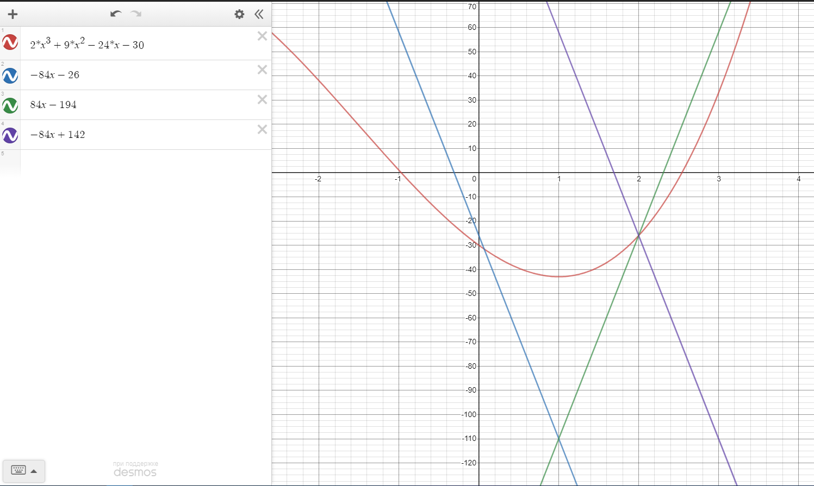

```{r setup, include=FALSE}
knitr::opts_chunk$set(echo = TRUE, comment = NA)
options(digits = 5)
```

\pagebreak
\vspace*{\fill}
\section*{Задание}

Для заданной функции $f(x) = 2x^3+9x^2-24x-30, \quad x \in \left[0;3\right]$:

\begin{enumerate}
  \item Используя все целочисленный точки отрезка $\left[0;3\right]$ найти аппроксимирующую линейную функцию вида $y = kx + l$ методом наименьших квадратов.
  \item[] В задачах 2-8 найти приблизительные значения точки минимума и минимума функции указанным методом. Задачи 2-7 -- для функции на отрезке $\left[0;3\right]$. Для задачи 5 сделать рисунок. Выполнить 2 итерации. Вычисления проводить с точностью до двух десятичных знаков.
  \item Метод деления отрезка пополам, $\delta = 0.1$.
  \item Метод золотого сечения.
  \item метод парабол, $u_0 = 1.5, h = 0.2$.
  \item Метод ломаных, $x_0 = 2$.
  \item Метод средней точки.
  \item Метод хорд.
  \item Метод Ньютона, $x_0 = 2, \quad \left[0,3\right]$.
\end{enumerate}
\vspace*{\fill}
\pagebreak


\section{МНК}

В соответствии с методом наименьших квадратов коэффициенты $k,l$ найдем по формулам:

\begin{equation}\left\{\begin{array}{l}
k=\frac{n \sum\limits_{i=1}^{n} x_{i} y_{i}-\sum\limits_{i=1}^{n} x_{i} \sum\limits_{i=1}^{n} y_{i}}{n \sum\limits_{i=1}^{n} x_{i}^{2}-\left(\sum\limits_{i=1}^{n} x_{i}\right)^{2}} \\
l=\frac{\sum\limits_{i=1}^{n} y_{i}-k \sum\limits_{i=1}^{n} x_{i}}{n},
\end{array}\right.\end{equation}

где $n=4$.

Посчитаем соответствущие значения:

```{r echo=TRUE, message=TRUE, warning=FALSE}
x <- 0:3
x
```


```{r echo=TRUE, message=TRUE, warning=FALSE}
f <- function(x)
{
  2*x^3 + 9*x^2 -24*x -30
}
```

```{r echo=TRUE, message=TRUE, warning=FALSE}
y <- f(x)
y
```

```{r echo=TRUE, message=TRUE, warning=FALSE}
xy <- x * y
xy
```

```{r echo=TRUE, message=TRUE, warning=FALSE}
x_sq <- x^2
x_sq
```

И соответствующие суммы:

```{r echo=TRUE, message=TRUE, warning=FALSE}
sum(x)
sum(y)
sum(xy)
sum(x_sq)
sum(x^2)
sum(x)^2
```


Тогда можем рассчитать наши значения $k,l$:

\begin{equation}\left\{\begin{array}{l}
k=\frac{4 \cdot 4 - 6 \cdot (-66) }{4 \cdot 14 - 36} = \frac{412}{20} = 20.6\\
l=\frac{-66 - 20.6 \cdot 6}{4} = \frac{-189.6}{4} = -47.4
\end{array}\right.\end{equation}

Проверим:

```{r}
lm(y~x)
```

Действительно, наши рассчёты верны.

Таким образом линейная аппроксимация заданной функции имеет вид:

\begin{equation}
  g(x) = 20.6x - 47.6
\end{equation}

Можем для примера изобразить исходную функцию и полученную методом МНК линейную аппроксимацию. Для этого зададим большее число точек на исходном отрезке $\left[0;3\right]$:

```{r}
x_for_plot <- seq(0,3,0.01)
```

```{r echo=TRUE, warning=FALSE, out.width = "70%"}
plot(f(x_for_plot)~x_for_plot, type = "l", lwd = 2, col = "lightblue",
     xlab = "", ylab = "")
abline(lm(y~x), col = "lightgreen", lwd = 2)
```


\section{Метод деления отрезка пополам}

По условию $\delta = 0.1$. 
Рассмотрим первую итерацию: 

```{r}
a <- 0
b <- 3
d <- 0.1
```

```{r}
u1 <- (a+b-d)/2
u1
```

```{r}
u2 <- (a+b+d)/2
u2
```

```{r}
f(u1)
f(u2)
```

Получили, что $f(u_1) < f(u_2)$, следовательно $a_1 = a, b_1 = u_2$. Тогда вторая итерация:

```{r}
a1 <- a
b1 <- u2
```

```{r}
u3 <- (a1+b1-d)/2
u3
```
```{r}
u4 <- (a1+b1+d)/2
u4
```

```{r}
f(u3)
f(u4)
```

Получили, что $f(u_3) > f(u_4)$, следовательно $\overline{u} = u_4 = 0.825$, тогда минимум функции $m_* \approx f(\overline{u}) \approx -42.55$.


\pagebreak

\section{Метод золотого сечения}

Первая итерация:

```{r}
a <- 0
b <- 3
```

```{r}
u1 <- a + (3- sqrt(5))/2 * (b-a)
u1
```
```{r}
u2 <- a + (sqrt(5) - 1)/2 * (b-a)
u2
```

```{r}
f(u1)
f(u2)
```

Получили $f(u_1) < f(u_2) \Rightarrow a_2 = a, b_2 = u_2, \overline{u}_2=u_1$

```{r}
(a2 <- a)
(b2 <- u2)
(u2_tmp <- u2)
```

Вторая итерация:

```{r comment=NA}
u3 <- a2 + (sqrt(5)-1)/2 * (b2-a2)
u3
```

```{r}
f(u2_tmp)
f(u3)
```

Получили, что $f(\overline{u}_2) > f(u_3)$, следовательно точка минимума $\overline{u}_3 =  0.825$, а минимум функции $m_* \approx -41.91$.


\pagebreak

\section{Метод парабол}
Полагаем $u_0 = 1.5, \; h = 0.2$.

Первая итерация:

```{r}
u0 <- 1.5
h <- 0.2
```

```{r}
f(u0)
```

Рассмотрим точку $u_1 = u_0 + h$:

```{r}
u1 <- u0 + h
u1
```

Так как $u_1 \in \left[0;3\right]$, то вычислим также $f(u_1)$:

```{r}
f(u1)
```

Получили, что $f(u_0)<f(u_1)$, следовательно:

```{r}
u2 <- u0 + 2^(2-1) * h
u2
```

$u_2 \in \left[0;3\right] \Rightarrow$

```{r}
f(u2)
```
Создадим функцию для проверки на выпуклость комбинации. Она возвращает булевский вектор длины 4, каждый элемент которого отвечает за соответствующую проверку на выпуклость. Можно было бы возвращать одно булево значение, равное применению логического "И" на этих 4 значениях, но вывод результата всех проверок кажется более наглядным:
```{r}
check_convex <- function(x1,x2,x3, f)
{
  chk1 <- (x1 < x2) & (x2 < x3)
  chk2 <- f(x1) >= f(x2)
  chk3 <- f(x2) <= f(x3)
  chk4 <- (f(x1) + f(x3)) > 2*f(x2)
  return(c(chk1 , chk2 , chk3 , chk4))
}
```


Проверим полученную комбинацию на выпуклость:
```{r}
check_convex(u0,u1,u2,f)
```

Получили, что данная комбинация не является выпуклой. Следовательно рассмотрим следующую точку:

```{r}
u3 <- u0 + 2^(3-1) * h
u3
```


Проверим комбинацию $u_1,u_2,u_3$ на выпуклость:

```{r}
check_convex(u1,u2,u3, f)
```

Получили, что данная комбинация не является выпуклой. Следовательно рассмотрим следующую точку:

```{r}
u4 <- u0 + 2^(4-1) * h
u4
```

Получили, что выпуклая комбинация так и не найдена, а очередная точка $u_4 \notin [0;3]$. Следовательно, полагаем $w = b$

Вычислем $f(w)$:

```{r}
w <- b
f(w)
```

Найдём точку $\overline{u}_4$ такую, что 

\begin{equation}
  f\left(\bar{u}_{n}\right)=\min \left(f(w), f\left(u_{0}\right), f\left(u_{1}\right), \ldots f\left(u_{n}\right)\right)
\end{equation}

```{r}
min(f(w), f(u0), f(u1), f(u2), f(u3))
```

Что соответствует точке $a = 0$, тогда $m_* \approx f(a) = -39$

\pagebreak

\section{Метод ломаных}
По условию $x_0 = 2$. Чтобы оценить постоянную Липшица, вычислим производную функции $f(x)$. Производная $f'(x)=6x^2+18x-24$ принимает на отрезке $[0;3]$ значения от -24 до 84. Таким образом, $L = 84$. Тогда:

\begin{equation}
  \begin{array}{l}
  p_0(x) = g_{2}(x) = f(2) - 84|x-2| = -26 - 84 |x-2| =  \\
  =\left\{\begin{array}{ll}
  -26 - 84 (-x+2)=84x-194, & \text { если }0 \leqslant x \leqslant2 \\
  -26 - 84 (x-2)=-84 x+142, & \text { если }2<x \leqslant 3
  \end{array}\right.
  \end{array}
\end{equation}

Отсюда $p_0(0) = -194, \quad p_0(3) = -110$ и $x_1=0$.

Функция $g_0(x) = -26 - 84|x-0| = -84x - 26 \quad \forall x \in [0;3]$, и пересекается с функцией $p_0(x)$ в точке $1$. Тогда 

\begin{equation}
  p_{1}(x)=\left\{\begin{array}{lll}
  -84x - 26, & \text { если }0<x \leqslant 1\\
  84x-194, & \text { если }1 < x \leqslant 2 \\
  -84 x+142, & \text { если }2<x \leqslant 3 \\
\end{array}\right.
\end{equation}

Отсюда $x_2 = 1$.

Получили точку минимума $x_2 = 1$, а минимум функции $m_* = -43$





\pagebreak
\section{Метод средней точки}

```{r}
a0 <- 0
b0 <- 3
```


Производная:

```{r}
f_d <- function(x)
{
  6*x^2+18*x-24
}
```

```{r}
f_d(a0)
f_d(b0)
```

$f'(a_0) < 0, \; f'(b_0) > 0$. Тогда

```{r}
c0 <- (a+b)/2
c0
```

```{r}
f_d(c0)
```

$f'(c_0) > 0$

Отсюда


```{r}
(a1 <- a0)
(b1 <- c0)
```

Тогда $c_1$

```{r}
c1 <- (a1+b1)/2
c1
```

```{r}
f_d(c1)
```

$f'(c_1) < 0$

Отсюда

```{r}
(a2 <- c1)
(b2 <- b1)
```

Тогда $c_2$

```{r}
c2 <- (a2+b2)/2
c2
```
```{r}
f(c2)
```


Следовательно, приблизительное значение точки минимума можно взять $c_2=1.125$, минимум функции $m_* \approx -42.762$.


\pagebreak

\section{Метод хорд}

```{r}
a0 <- 0
b0 <- 3
```


```{r}
f_d <- function(x)
{
  6*x^2+18*x-24
}
```

```{r}
f_d(a0)
f_d(b0)
```

Получили, что $f'(a_0) < 0, \; f'(b_0) > 0$. Функция для получения $c_k$ имеет вид:

```{r}
ck <- function(a,b,fd)
{
  (fd(b)*a - fd(a)*b)/(fd(b) - fd(a))
}
```

Тогда $c_0$:

```{r}
(c0 <- ck(a0,b0,f_d))
```

```{r}
f_d(c0)
```

Получили, что $f'(c_0) < 0$. Отсюда 

```{r}
a1 <- c0
b1 <- b0
c1 <- ck(a1,b1,f_d)
c1
```


```{r}
f_d(c1)
```

Получили, что $f'(c_1) < 0$. Отсюда 

```{r}
a2 <- c1
b2 <- b1
c2 <- ck(a2,b2,f_d)
c2
f(c2)
```

Приблизительное значение точки минимума возьмём $c_2 \approx 0.97$, минимум функции $m_* \approx -42.99$


\pagebreak

\section{Метод Ньютона}

По условию $x_0 = 2, \; c = 0, \; d = 0$. Получаем:

\begin{equation}
  f(x) = 2x^3+9x^2-24x-30
\end{equation}

\begin{equation}
  f'(x) = 6x^2+18x-24
\end{equation}

\begin{equation}
  f''(x) = 12x+18
\end{equation}

\begin{equation}
  f'''(x) = 12
\end{equation}

Таким образом, на отрезке $[0;3]$

\begin{equation}
  18 \leq f''(x) \leq 54, \quad f'''(x) \leq 12 
\end{equation}

Запишем вторую производную:
```{r}
f_2d <- function(x)
{
  12*x+18
}
```

А так же начальную точку:

```{r}
x0 <- 2
```


Выполним терацию метода средней точки. Получаем:

```{r}
x1 <- x0 - f_d(x0) / f_2d(x0)
x1
```

$x_1 \in [0;3]$

Вторая итерация:

```{r}
x2 <- x1 - f_d(x1) / f_2d(x1)
x2
f(x2)
```

$x_2 \in [0;3]$

Приблизительное значение точки минимума $x_2 \approx 1$, минимум функции $m_* \approx -43$


